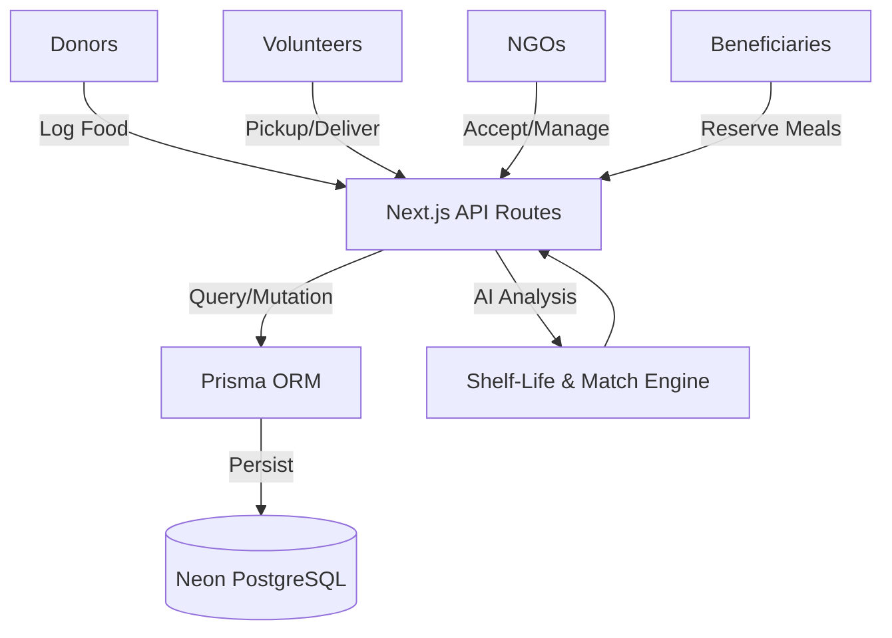

# 🍱 FeedLink X — AI-Powered Food Surplus & Hunger Management

## 🎯 Project Overview
**FeedLink X** is a high-performance Next.js application designed to eliminate food waste by bridging the gap between food donors (hotels, caterers, restaurants) and those in need (NGOs, shelters, beneficiaries). 

The platform has transitioned from a mock-data prototype to a **production-ready architecture** backed by **Neon PostgreSQL**, featuring AI-driven logistics and 100% data persistence.

---

## 🏗️ System Architecture

### High-Level Flow

### Tech Stack
*   **Frontend:** Next.js 16 (App Router), React 19, Vanilla CSS (Premium Aesthetics)
*   **State Management:** React Context (AppContext) with DB-Sync Wrapper
*   **Database:** Neon PostgreSQL (Serverless)
*   **ORM:** Prisma 7 with Driver Adapters
*   **Authentication:** Custom API-based Auth with `bcryptjs` hashing
*   **Deployment:** Vercel (CI/CD with Prisma generation)

---

## 🌟 Core Features (Database-Backed)

### 1. 🍽️ Smart Donor Dashboard
*   **Real-time Persistence:** Every donation is immediately saved to PostgreSQL.
*   **AI Shelf-Life Engine:** Calculates freshness hours based on food category and temperature.
*   **Urgency Tagging:** Automatically flags food based on calculated expiration.

### 2. 🏥 NGO Command Center
*   **Capacity Management:** Real-time tracking of storage availability.
*   **Automated Matching:** NGOs receive "Best Match" suggestions based on proximity and capacity.

### 3. 🚴 Volunteer Gamification
*   **Chain of Custody:** QR code verification for pickups and deliveries.
*   **Leadership:** Global leaderboard synced with PostgreSQL points system.

### 4. 🧊 Community Features
*   **IoT Fridge Monitoring:** Digital twins of physical community fridges tracking fill levels.
*   **Disaster Relief:** Coordination modules for emergency food camps.

---

## 🛠️ Engineering Challenges & Solutions

### 1. The "Sync-to-DB" State Pattern
**Challenge:** Initially, the app used a standard React `useReducer` which lost all data on refresh.
**Solution:** I implemented a **Middleware Pattern** in `AppContext.js`. I wrapped the standard `dispatch` function with a `syncToDatabase` utility. Whenever a UI action occurs (Accepting food, adding a donation), the system simultaneously updates the local state (for instant UI feedback) and triggers an asynchronous `fetch` to PostgreSQL. Result: 0ms perceived lag with 100% data durability.

### 2. Prisma 7 & Neon Connectivity
**Challenge:** Connecting a serverless Next.js environment to Neon often faces connection pooling issues or module resolution errors in Turbopack.
**Solution:** Configured the `PrismaNeon` driver adapter and implemented a singleton pattern for the `PrismaClient`. I also added a custom `build` script (`prisma generate && next build`) to ensure the client is correctly generated in the Vercel ephemeral build environment.

### 3. Haversine Logistics Engine
**Challenge:** Traditional database queries for "nearby" entities are expensive.
**Solution:** Implemented the **Haversine Formula** within the Smart Match engine to calculate earth-surface distances between donors and NGOs, weighting results by storage capacity to prevent "NGO Overload."

---

## 🚀 Future Roadmap
1.  **AI Image Verification:** Using Computer Vision to verify food quality via photo uploads.
2.  **Live Maps Integration:** Moving from coordinate-based math to real-time Google Maps/MapBox routing.
3.  **Real-time WebSockets:** Using Supabase or Pusher for instant volunteer pickup notifications.
